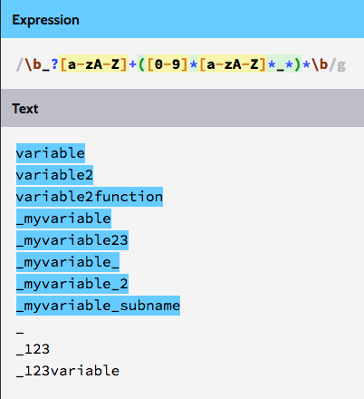

## Lexical Rules (Regular Expressions)
#### IDENTIFIER
id → \b_?[a-zA-Z]+([0-9]*[a-zA-Z]*_*)*\b

The production above shows us the lexical rules of an identifier. Here is the match examples:


> This is the result from [http://regexr.com/](http://regexr.com/).

An identifier must begin with '_' or an alphabet character (both upper case or lower case). Within an identifier, combination of alphabet characters, numbers and underscore is needed.

For example, the following examples are correct:

```
_variable
__variable
_variable2
_variable2next_
variable
variable_subvariable
variable2
variable2next
variable_2next
...
```
However, the following examples are not supported:

```
%variable
@variable
$variable
...
```

#### KEYWORD
keywd → string | number | boolean | true | false | for | if | else | void

The production shows the avaliable types of keywords.

#### OPERATOR
opt → **+** | **-** | **\*** | **/** | **=** | **==** | **>** | **<** | **<=** | **>=** | **!=** | **&&** | **||**

#### DELIMITER
dlmt → **;** | **,** | **(** | **)**  | **/\*** | **\*/** | **:** | **'** | **"** | **_** | **.** | **{**  | **}**